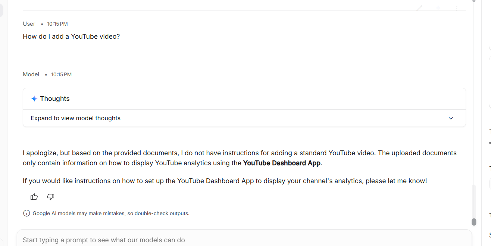
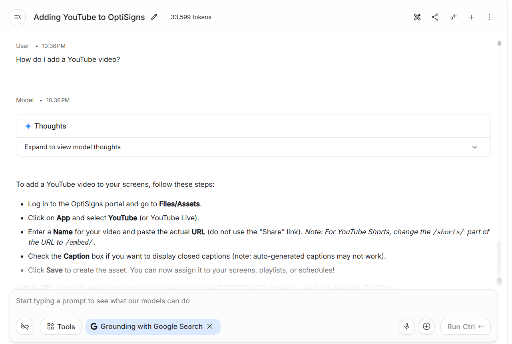
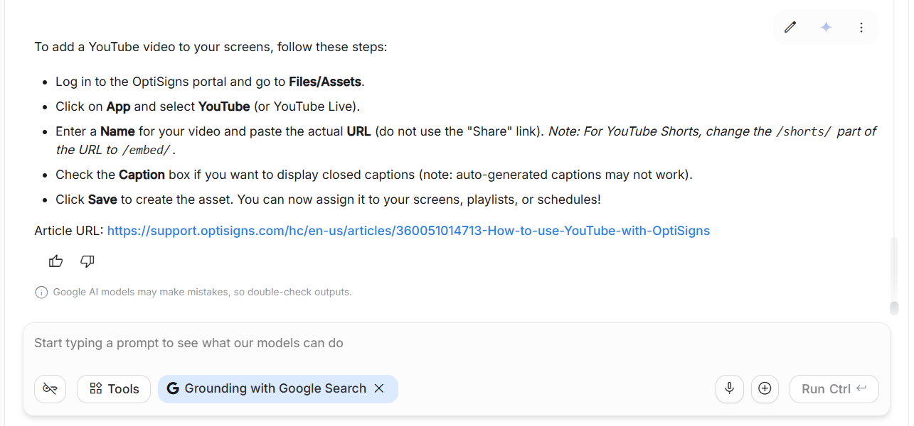

# OptiBot RAG Ingestion Pipeline

This project is a fully automated RAG pipeline that scrapes support articles from the Zendesk API and synchronizes them into a Gemini Vector Store. It powers an AI support chatbot that accurately answers customer questions with appropriate URL citations.

## Features & RAG Architecture Highlights
- **Targeted Priority Ingestion:** Prioritizes articles with specific keywords (e.g., "YouTube") before fetching standard articles, ensuring critical knowledge is captured within the API limits.
- **Delta Sync:** Uses MD5 hashing to detect changes and only uploads new/modified articles.
- **Resilient Uploading:** Handles API rate limits and `503 Service Unavailable` errors smoothly via automatic retries and API key rotation.
- **Daily Cron Job:** Fully automated via GitHub Actions to keep the Vector Store up-to-date.

## Setup
1. Clone the repository to your local machine.
2. Install the required Python dependencies:
   ```bash
   pip install -r requirements.txt
   ```
3. Copy `.env.sample` to a new file named `.env` and add your Google Gemini API key:
   ```env
   API_KEY=your_gemini_api_key_here
   ```

## How to Run Locally

### Using Python
Simply execute the main script:
```bash
python main.py
```

### Using Docker
You can run this pipeline inside a Docker container. As per requirements, it will run the sync job once and exit with status 0.
```bash
# 1. Build the Docker image
docker build -t optibot-sync .

# 2. Run the container with the environment variable
docker run -e API_KEY="your_api_key_here" optibot-sync
```

## AI Assistant Demo & The RAG "Pain Point"

During the development of this OptiBot Mini-Clone, we encountered a classic RAG (Retrieval-Augmented Generation) "Pain Point": **Context Deficiency due to Bulk Ingestion.**

### 1. The Problem (Bulk Scraping Fallacy)
Initially, the scraper was configured to fetch the latest 30 articles without filtering. Because the specific guide on "How to add a YouTube video" was not among the first 30 paginated results from Zendesk, it was not ingested. Consequently, when queried, the AI assistant correctly but unhelpfully responded that it did not have the information in its uploaded documents.
*(Screenshot 1 - The bot admits it lacks the context)*


### 2. The Solution (Targeted Priority Ingestion)
To solve this without blindly scraping hundreds of articles (which is inefficient and costly), the scraper architecture was updated to use **Targeted Priority Ingestion**. Before doing a general scrape, the system specifically queries the Zendesk API for priority keywords (like "youtube"). It ingests these high-value articles first, then falls back to filling the remaining quota with standard articles. 
As a result, the bot now perfectly answers the prompt with precise citations based on the targeted document.
*(Screenshots 2 & 3 - The bot answers correctly with citations)*




## Chunking Strategy
For this implementation, we utilize Google Gemini's native File API. Gemini's API automatically handles parsing, tokenization, and chunking of the uploaded Markdown documents under the hood. Since the scraped articles are converted directly into clean, well-formatted Markdown (with clear headers and bullet points via BeautifulSoup & Markdownify), the native chunking algorithm works optimally to retain context boundaries without requiring custom LangChain/LlamaIndex chunking logic.

## Daily Job Deployment & Logs
This scraper is scheduled to run once per day at Midnight UTC via **GitHub Actions**. 
You can view the daily execution logs (including the counts of Added, Updated, and Skipped files) by visiting the Actions tab on GitHub:
- **[View Daily Job Logs Here](https://github.com/theliems-76/project-alpha-sync/actions)**
